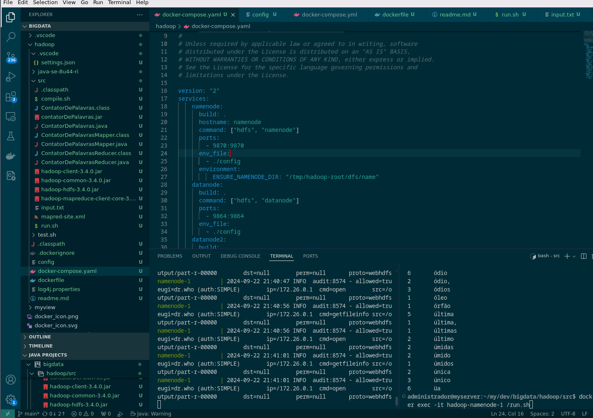

# Hadoop Example



Rodar o ambiente e o algoritmo Contador de Palavras

```
cd ./src/
./compile.sh 
# or ./compileScala.sh
cd ..
docker-compose build
docker-compose up -d
# await 4s, o tempo de subida dos containers 
docker exec -it hadoop_namenode_1 /run.sh
```

## Dowload jdk for compile

Download openjdk 8:
```
wget https://download.java.net/openjdk/jdk8u44/ri/openjdk-8u44-linux-x64.tar.gz
```
Download scala 2.13.0:
```
wget https://github.com/scala/scala3/releases/download/2.13.0/scala-2.13.0.tar.gz
# set in scripts /bin 
# export JAVA_HOME=/home/administrador/my/dev/bigdata/hadoop/java-se-8u44-ri
```

Kotlin infelizmente precisaria de mais engenharia, mas vc pode encontrar em: https://github.com/TeemuKoivisto/kotlin-hello-big-data
